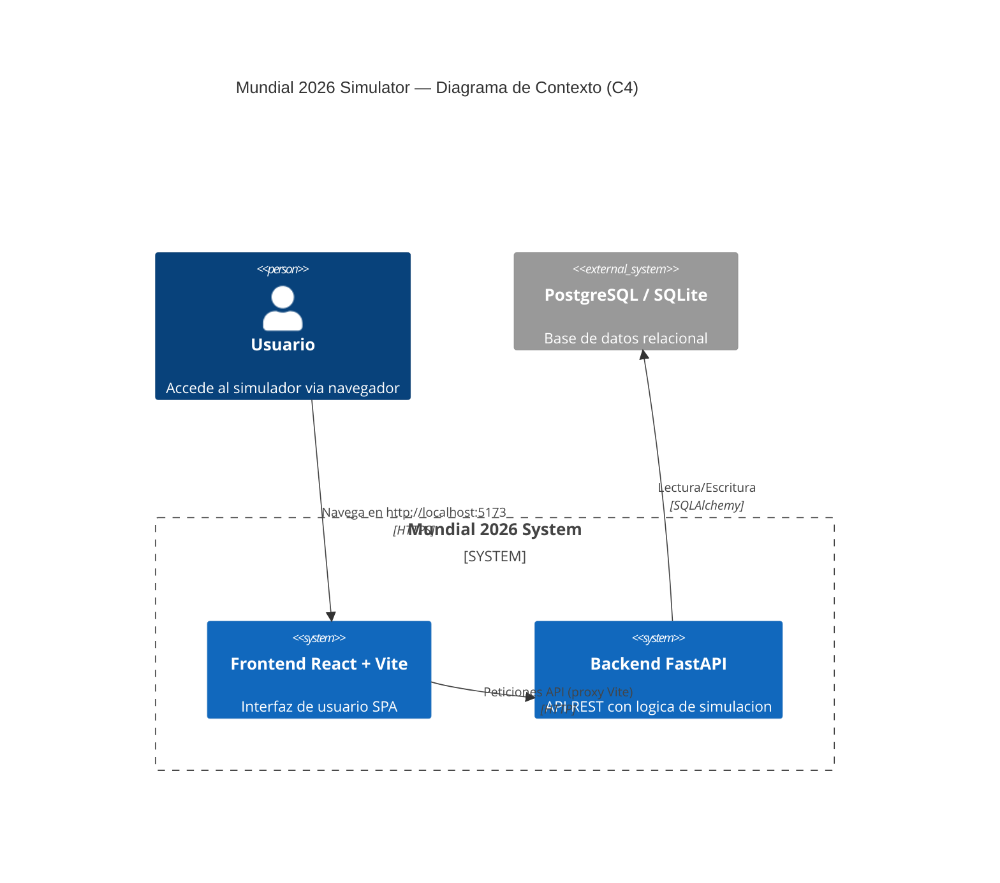

# Arquitectura del Proyecto

## Diagrama C4 — Nivel Contexto



## Arquitectura Actual (Nueva)

```
┌─────────────────────────────────────────────────────┐
│                   Navegador                          │
│  ┌─────────────────────────────────────────────┐    │
│  │           Frontend React + Vite              │    │
│  │  ┌─────────┐  ┌─────────┐  ┌────────────┐  │    │
│  │  │ Header  │  │  Hero   │  │   Footer   │  │    │
│  │  └─────────┘  └─────────┘  └────────────┘  │    │
│  │  ┌──────────────┐  ┌──────────────────┐    │    │
│  │  │ TeamsSection │  │     Bracket      │    │    │
│  │  └──────────────┘  └──────────────────┘    │    │
│  │  ┌──────────────┐  ┌──────────────┐       │    │
│  │  │  Dashboard   │  │   Spinner    │       │    │
│  │  └──────────────┘  └──────────────┘       │    │
│  │  ┌────────────────────────────┐            │    │
│  │  │         api.js             │            │    │
│  │  └────────────────────────────┘            │    │
│  └─────────────────────────────────────────────┘    │
│                         │ Proxy (Vite)              │
│                         ▼                           │
│  ┌─────────────────────────────────────────────┐    │
│  │           Backend FastAPI                    │    │
│  │  Router ───► Service ───► Repository        │    │
│  │         │                                    │    │
│  │         ▼                                    │    │
│  │  PostgreSQL / SQLite (worldcup.db)           │    │
│  └─────────────────────────────────────────────┘    │
└─────────────────────────────────────────────────────┘
```

## Arquitectura Anterior (Monolito — HTML servido por FastAPI)

```
┌────────────────────────────────────────────────────┐
│               FastAPI Server                        │
│  ┌──────────────────────┐                           │
│  │   static/index.html  │  ◄── StaticFiles("/")    │
│  │   (Todo el HTML,     │                           │
│  │    CSS y JS inline)  │                           │
│  └──────────────────────┘                           │
│  Router ───► Service ───► Repository ───► DB        │
└─────────────────────────────────────────────────────┘
```

## Cambios Realizados

### Backend (`main.py`)
- **Eliminado:** `app.mount("/", StaticFiles(directory="static", html=True))`
- **Agregado:** `CORSMiddleware` permitiendo origen `http://localhost:5173`
- **Agregado:** `from fastapi.middleware.cors import CORSMiddleware`

### Frontend (nuevo — `/frontend/`)
- Proyecto React + Vite creado con `npm create vite@latest`
- Proxy configurado en `vite.config.js` para rutas del backend
- Imágenes movidas a `frontend/public/images/`
- Componentes:
  - `Header.jsx` — Top bar con logo
  - `Hero.jsx` — Seccion hero con boton de simulacion
  - `Spinner.jsx` — Overlay de carga
  - `TeamsSection.jsx` — Tabla de grupos
  - `Bracket.jsx` — Bracket eliminatorio
  - `Dashboard.jsx` — KPIs del dashboard
  - `Footer.jsx` — Footer con logo
- `api.js` — Funciones `fetchTeams()`, `runSimulation()`, `fetchDashboard()`
- `App.jsx` — Componente raiz que orquesta todo
- `styles/index.css` — Todos los estilos migrados del HTML original

## Archivos Creados

| Archivo | Proposito |
|---------|-----------|
| `frontend/package.json` | Dependencias del frontend |
| `frontend/vite.config.js` | Proxy de desarrollo |
| `frontend/src/api.js` | API calls |
| `frontend/src/App.jsx` | Componente raiz |
| `frontend/src/main.jsx` | Entry point de Vite |
| `frontend/src/styles/index.css` | Estilos migrados |
| `frontend/src/components/Header.jsx` | Top bar |
| `frontend/src/components/Hero.jsx` | Hero section |
| `frontend/src/components/Spinner.jsx` | Loading spinner |
| `frontend/src/components/TeamsSection.jsx` | Grupos |
| `frontend/src/components/Bracket.jsx` | Bracket |
| `frontend/src/components/Dashboard.jsx` | Dashboard KPIs |
| `frontend/src/components/Footer.jsx` | Footer |
| `frontend/public/images/logo-color.png` | Logo color |
| `frontend/public/images/logo-blanco.png` | Logo blanco |
| `ARQUITECTURA.md` | Este documento |

## Archivos Modificados

| Archivo | Cambio |
|---------|--------|
| `main.py` | Sacado StaticFiles, agregado CORS |

## Archivos Eliminados

| Archivo | Razon |
|---------|-------|
| `static/index.html` | Migrado a React |
| `frontend/src/App.css` | Template Vite residual |
| `frontend/src/index.css` | Template Vite residual |
| `frontend/src/assets/` | Template Vite residual |

## Como Ejecutar

```bash
# Backend
python main.py

# Frontend (nueva terminal)
cd frontend
npm run dev
```

Luego abrir `http://localhost:5173` en el navegador.
